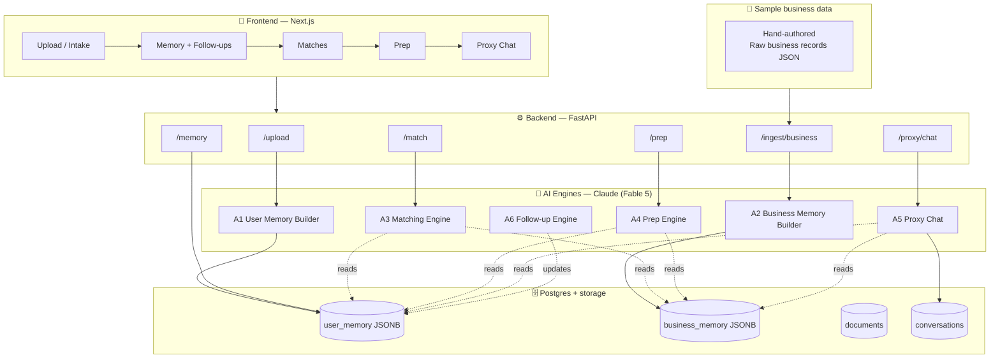
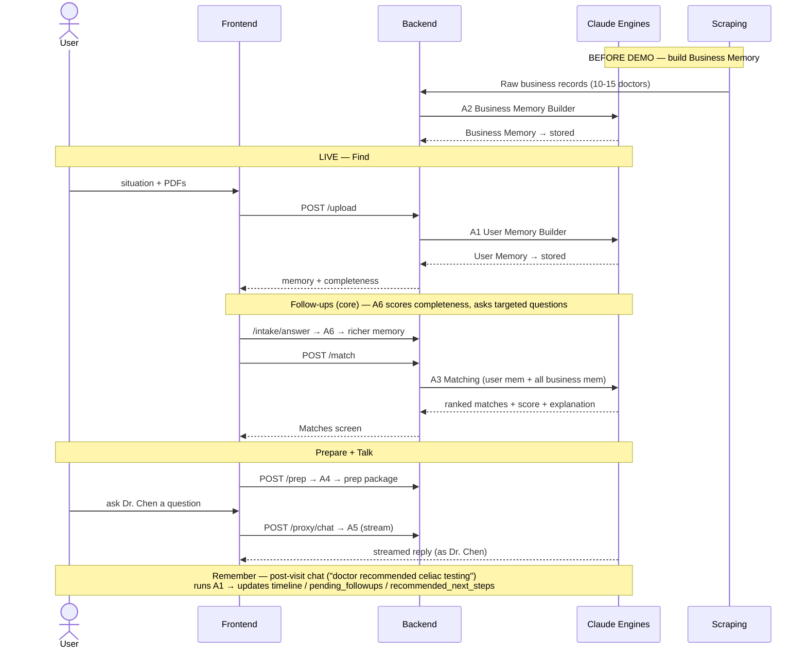

# OpenJetty — Architecture (Memory-First, Hackathon MVP)

> **The system design + the shared contracts.** This is the single source of truth for *what
> the system is*: components, data model, API contracts, and workflow.
> Per-role build details ("what each person codes") → `build-specs.md`.
> Who builds what + build order → `division-of-work.md`.

---

## 1. What we're building (one paragraph)

OpenJetty builds **persistent memory** for both users and businesses, then uses Claude to
**match** them, **prepare** the user before a visit, and power a **business AI proxy chat** —
with memory that **continuously updates**. The innovation is the memory layer; matching and
chat are extensions of it. Doctor vertical only for the MVP.

**Core philosophy — two evolving memory engines:**
- **User Memory** — everything known about a patient (conditions, symptoms, lab trends,
  history). Updates on every upload/chat.
- **Business Memory** — everything known about a doctor (specialties, conditions treated,
  protocols, FAQs). Built from hand-authored sample records (staged data) for the MVP.

Claude reasons across these two memories to determine fit — **not keyword search.**

### Memory storage model (Hybrid Memory — 3 layers)
1. **Raw documents** — original PDFs/files (`documents` table). Preserved for audit/reprocessing.
2. **Structured memory** — Claude-generated JSONB. **The primary reasoning source** (User Memory
   §4.1, Business Memory §4.2).
3. **Embeddings** — small vectors from memory. **Phase-2 only** (fast retrieval / scalability) —
   *not* the MVP matching mechanism. MVP matching = Claude reasoning over structured memory.

---

## 2. System Architecture



**Layers:** Frontend (render) → Backend (orchestrate + store) → AI engines (reason) →
Postgres (memory). Sample business records are seeded into Business Memory before the demo.

---

## 3. The 6 AI Engines (conceptual)

Each engine = one Claude call. All structured-output (JSON) except Proxy Chat (streamed).
Model **Fable 5 (`claude-fable-5`)**. No vector DB — full structured memory into context.
*(Exact prompts/schemas → `build-specs.md` §AI.)*

| Engine | Does | In → Out |
|---|---|---|
| **A1 User Memory Builder** | Extract + merge user knowledge | doc/chat text + prior memory → User Memory |
| **A2 Business Memory Builder** | Structure doctor data | raw business record → Business Memory |
| **A3 Matching Engine** ⭐ | Reason fit, rank, explain | user mem + N business mems → matches + score + why |
| **A4 Prep Engine** | Pre-visit package | user mem + matched business → prep package |
| **A5 Proxy Chat** | Answer as the doctor | business mem + user mem + history → streamed reply |
| **A6 Follow-up Engine** | Find gaps, ask questions, score completeness | user mem → completeness + missing + questions |

---

## 4. Data Model — SHARED CONTRACTS (source of truth)

> Everyone builds against these. Lock them first. `build-specs.md` references these — they
> live **only here** to avoid drift.

### 4.1 User Memory (JSONB)
```json
{
  "medical_conditions": [],
  "symptoms": [],
  "timeline": [],
  "medications": [],
  "previous_treatments": [],
  "lab_trends": [],
  "doctor_visits": [],
  "uploaded_documents": [],
  "preferences": [],
  "active_questions": [],
  "pending_followups": [],
  "ai_observations": [],
  "recommended_next_steps": [],
  "completeness": 0
}
```

### 4.2 Business Memory (JSONB)
```json
{
  "business_id": "dr-sarah-chen",
  "name": "Dr. Sarah Chen",
  "specialty": "Hematology",
  "location": "San Francisco, CA",
  "rating": 4.9,
  "review_count": 132,
  "source": ["google_places", "healthgrades"],
  "specialties": [],
  "conditions_treated": [],
  "services": [],
  "treatment_philosophy": "",
  "expertise_keywords": [],
  "experience": "",
  "preferred_cases": [],
  "excluded_cases": [],
  "faqs": [],
  "protocols": [],
  "ai_notes": []
}
```

### 4.3 Match result
```json
{
  "matches": [
    {
      "business_id": "dr-sarah-chen",
      "name": "Dr. Sarah Chen",
      "specialty": "Hematology",
      "score": 0.92,
      "confidence": "high",
      "explanation": "Expertise in iron deficiency and malabsorption aligns with the user's declining ferritin, failed oral supplementation, and chronic fatigue."
    }
  ]
}
```

### 4.4 Prep package
```json
{
  "situation_summary": "18-month decline in ferritin and B12 with persistent fatigue",
  "questions_to_ask": ["Could this indicate malabsorption?", "Should celiac be investigated?"],
  "documents_to_bring": ["Previous lab reports", "Supplement history"],
  "tests_to_discuss": ["Ferritin", "Iron studies", "B12", "Folate", "Celiac antibodies"]
}
```

### 4.5 Raw business record (sample data → backend handoff)
> Hand-authored sample records (staged data) for the MVP — same shape, just written by us instead
> of fetched. Seeded into the backend on startup.
```json
{
  "business_id": "dr-sarah-chen",
  "name": "Dr. Sarah Chen",
  "specialty": "Hematology",
  "location": "San Francisco, CA",
  "rating": 4.9,
  "review_count": 132,
  "reviews": ["sample review text...", "sample review text..."],
  "profile_text": "<sample profile text written for the demo>",
  "guideline_text": "<sample clinical-protocol text written for the demo>",
  "source": ["sample"]
}
```

---

## 5. API Contracts — SHARED (source of truth)

| Method | Endpoint | In | Out | Calls |
|---|---|---|---|---|
| POST | `/upload` | file (PDF) + user_id | updated User Memory | A1 |
| POST | `/intake/answer` | user_id + answers[] | updated User Memory + completeness | A1, A6 |
| GET | `/memory/{user_id}` | — | User Memory JSON | — |
| POST | `/match` | user_id | Match result (4.3) | A3 |
| POST | `/prep` | user_id + business_id | Prep package (4.4) | A4 |
| POST | `/proxy/chat` | user_id + business_id + messages[] | streamed reply | A5 |
| POST | `/ingest/business` | Raw business record (4.5) | stored Business Memory | A2 |

---

## 6. End-to-End Workflow



---

## 7. Memory Update Lifecycle

Every upload/chat follows the same loop — this is the "memory-first" heart:

```
New document/chat
   ↓
Claude reads PREVIOUS memory
   ↓
Claude MERGES new info (doesn't overwrite)
   ↓
Updated structured memory stored (Postgres JSONB)
   ↓
Future calls automatically use it
```

The user never repeats themselves. Same loop for Business Memory when new data is ingested.

**Memory After Appointments.** A visit itself becomes memory. When the user later says
*"My doctor recommended celiac testing,"* A1 runs on that chat text and updates:
- `timeline` (visit + recommendation logged)
- `pending_followups` (celiac testing ordered)
- `active_questions` / `recommended_next_steps`

Future conversations automatically build on this — the loop never resets.

---

## 8. Scope

**Building (MVP core):** User Memory + Business Memory + Matching + Prep + Proxy Chat +
continuous memory update + **Follow-up question engine + completeness meter**.
**Phase-2 (listed, not MVP):** embeddings / pgvector — scalability & fast retrieval only;
Claude reasoning is the MVP matching mechanism.
**NOT building:** appointment booking/scheduling, auth, payments, EMR, multi-vertical,
live data fetching/scraping.

**Data sources (business side):** **hand-authored sample records (staged data)** in the §4.5
shape, seeded into the backend. Not uploaded by professionals, not fetched from external APIs for
the MVP. *(Production vision: fetch from public sources — out of scope for the hackathon.)*

### MVP Deliverables coverage (the plan's 8 deliverables → who delivers)

| # | Deliverable | Delivered by |
|---|---|---|
| 1 | Persistent User Memory | A1 + `user_memory` JSONB |
| 2 | Persistent Business Memory | A2 + `business_memory` JSONB |
| 3 | Automatic Memory Updates | A1 + Memory Update Lifecycle (§7) |
| 4 | Follow-up Question Engine | A6 (completeness + targeted questions) |
| 5 | Reasoning-based Matching | A3 (score + confidence + explanation) |
| 6 | Appointment Preparation | A4 (prep package) |
| 7 | Business AI Proxy | A5 (streamed, in the doctor's voice) |
| 8 | Continuous Memory Evolution | §7 lifecycle + Memory After Appointments |
