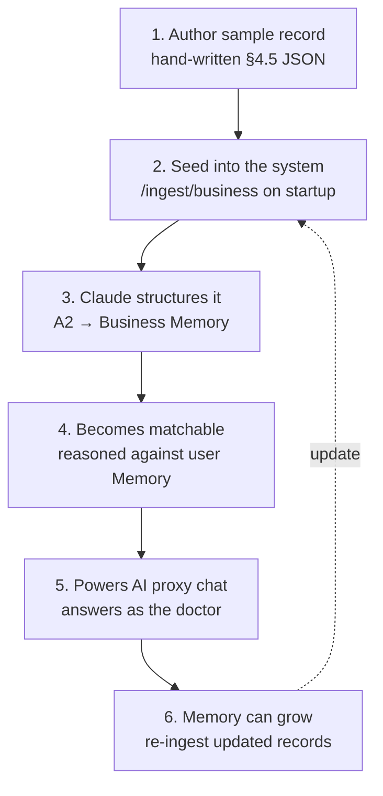

# OpenJetty — Business Side Flow (End-to-End)

> The business half of the product. **The key idea: a business doesn't upload anything.** For the
> hackathon MVP we **hand-author realistic sample business data** (staged), seed it into the system,
> and Claude turns it into a persistent **Business Memory** that can be matched and can answer
> questions as an AI proxy.
>
> *(Production vision: this same Business Memory would be built from public sources fetched
> automatically — out of scope for the hackathon. For now, the data is staged sample JSON.)*
>
> Technical pieces noted lightly in *behind the scenes*; full detail in `architecture.md`.

---

## The core idea (read this first)

On the consumer side, the *user* tells their story. On the business side, **the business does
nothing** — no sign-up, no upload, no forms. For the demo, **we create the business data ourselves**
as realistic sample records, and the system treats them exactly as if they were real.

> A hematologist in our demo has a name, reviews, a profile, and the clinical protocols for her
> field — all **written by us as a realistic sample**. The system reasons over it and she becomes a
> matchable, chat-ready profile. No business effort, no scraping, fully under our control for the demo.

Why staged data: it's controlled, reliable on stage, and lets us craft a clean demo story — while
still showing the **real AI** (Claude structuring, matching, and chatting over that data).

---

## The journey at a glance

```
1. Author the sample record   →  2. Seed it into the system
        ↓                                 ↓
        ↓                        3. Claude structures it → Business Memory
        ↓                                 ↓
4. Becomes matchable           →  5. Powers an AI proxy chat
        ↓                                 ↓
6. Memory can keep growing (re-edit / future: fetched updates)
```

No business person involved. The data is staged; the AI on top of it is real.

---

## Stage 1 — Author the sample business record

**What we do:** for each demo doctor, write a **Raw business record** (architecture.md §4.5) by hand
— realistic, not scraped:

| Field | What we write |
|---|---|
| `name`, `specialty`, `location`, `rating`, `review_count` | basic identity (realistic) |
| `reviews` | 2–4 believable sample review lines |
| `profile_text` | a short written bio / specialty blurb (what a profile page would say) |
| `guideline_text` | a short written clinical-protocol blurb (the doctor's "knowledge") |
| `source` | `["sample"]` |

**Make it tell the demo story:** the 3 **hero** doctors must clearly differ — a **hematologist**
specializing in iron deficiency / malabsorption (the right match for the ferritin story), plus a
gastroenterologist and an internist who are clearly weaker fits. This is what makes the match
obvious and the demo land.

> *Behind the scenes:* these are plain JSON files in a `sample-data/` folder, in the §4.5 shape.

---

## Stage 2 — Seed it into the system

**What happens:** the sample records are loaded into the backend on startup (a seed step posts each
one to `/ingest/business`).

> *Behind the scenes:* the backend reads `sample-data/*.json` and runs each through the ingest path.

**Why it matters:** by the time the demo starts, the "businesses" already exist in the system —
nothing is fetched live on stage.

---

## Stage 3 — Claude structures it into Business Memory

**What happens:** Claude reads each raw record and turns it into a clean, structured **Business
Memory** — the permanent knowledge profile for that doctor.

**What the Business Memory holds** (architecture.md §4.2):
- specialties, conditions treated, services
- treatment philosophy, expertise keywords, experience
- preferred vs excluded cases (who this doctor is right / wrong for)
- FAQs
- **protocols** (distilled from the written `guideline_text`)

> *Behind the scenes:* A2 (Business Memory Builder) converts the Raw business record into Business
> Memory and stores it. Same memory-first idea as the user side — built from staged data instead of
> an upload.

**Why it matters:** raw text isn't usable for matching; structured Business Memory is. This is the
**real AI step** — even though the input is sample data, Claude genuinely structures it.

---

## Stage 4 — It becomes matchable

**What happens:** once a doctor has a Business Memory, Claude can reason about it against any user.
When a user's situation comes in, Claude compares the **user's Memory** against each **Business
Memory** and ranks fit — with an explanation.

> *Behind the scenes:* A3 (Matching Engine) reasons over both memories — not keyword search — and
> writes *why* this doctor fits this specific user.

**Why it matters:** the right doctor surfaces for the right reasons, and the explanation references
the user's real details (declining ferritin, failed supplements).

---

## Stage 5 — It powers an AI proxy chat

**What happens:** the doctor's Business Memory becomes a **chat proxy**. The user can "talk to
Dr. Chen" and get answers grounded in that profile — in the doctor's voice — aware of the user's
history.

- Answers stream in, specific to the user.
- If asked something outside its knowledge, it says it'll flag the question for the visit — it never
  invents facts.

> *Behind the scenes:* A5 (Proxy Chat) uses the Business Memory + the user's Memory + the conversation.

**Why it matters:** the practice effectively has a concierge that knows its specialty *and* knows the
patient — built entirely from the staged profile, no business effort.

---

## Stage 6 — Memory can keep growing

**What happens:** the Business Memory isn't frozen. New information can be merged the same way the
user's memory grows — for the demo by editing/adding sample records, and in a real product by
re-fetching public data.

> *Behind the scenes:* re-ingesting an updated record → A2 merge keeps the Business Memory current.

---

## The whole business loop (one picture)



---

## Consumer side vs business side (how they mirror)

| | Consumer side | Business side |
|---|---|---|
| Who provides data | the **user** (types + uploads PDFs) | **nobody uploads** — we stage sample records |
| Raw input | situation text + lab PDFs | written reviews + profile_text + guideline_text |
| Builder engine | A1 (User Memory Builder) | A2 (Business Memory Builder) |
| Structured result | **User Memory** | **Business Memory** |
| Used for | being matched, prepped | matching, AI proxy chat |
| Data origin | real (the user's own) | **staged sample** (real in production) |

Both sides are **memory-first**. The only difference for the MVP: the user *gives* their story; the
business's story is *staged by us*. Claude reasons across the two memories to connect them.

---

## For the demo

- Business data is **hand-authored and seeded** for 3–5 doctors before the pitch — fully controlled,
  nothing fetched live.
- On stage, the story stays strong: *"The system already knows this clinic — its specialty, its
  reviews, its protocols — and it already knows why this patient is coming."*
- That line is the business-side "wow": **personalized from both sides.** (The data being staged is
  an implementation detail; in production it would be fetched from public sources.)
