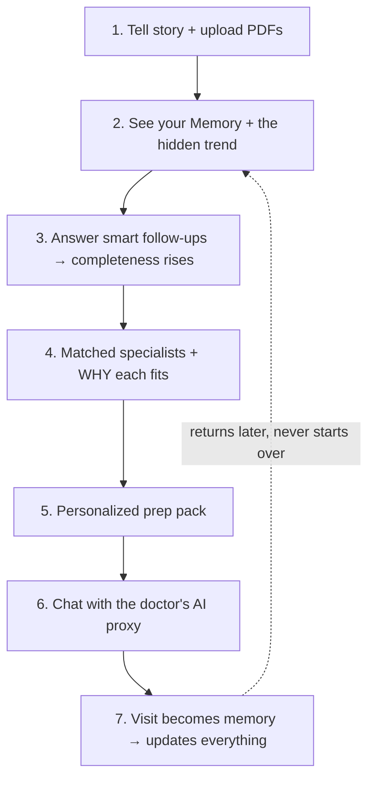

# OpenJetty — User Flow (End-to-End)

> The product from the **user's point of view** — what they see, what they do, what happens, and why
> it matters at each step. This is the experience the demo tells. Technical pieces (engines,
> endpoints) are noted lightly in *behind the scenes* lines; full detail lives in `architecture.md`.

---

## Who the user is

A patient who's been unwell for a while and keeps hitting dead ends. Example (our demo persona):

> *"I've been fatigued for 8 months. Three different GPs told me I'm fine. I have my blood tests but
> I don't know what they mean or who to see."*

They have documents, a vague worry, and no idea what kind of specialist they need. **OpenJetty's job:
turn that mess into clarity, a matched specialist, and a prepared first visit — and remember
everything so they never start from zero again.**

---

## The journey at a glance

```
1. Tell your story + upload docs   →  2. See what OpenJetty understood (your Memory)
        ↓                                        ↓
        ↓                              3. Answer a few smart follow-ups (fills the gaps)
        ↓                                        ↓
4. Get matched specialists (with WHY)  →  5. Get a prep pack for the visit
        ↓                                        ↓
6. Chat with the specialist's AI proxy  →  7. After the visit, it remembers & updates
```

Five screens, one continuous thread of memory underneath.

---

## Stage 1 — Tell your story + upload documents

**Where:** the Upload / Intake screen (the front door).

**What the user sees:** a calm, simple page — a big text box ("Tell us what's going on") and a
drag-and-drop zone for files.

**What the user does:**
- Types their situation in plain words: *"Fatigued for 8 months, 3 GPs found nothing, here are my
  blood tests."*
- Drags in their PDFs (e.g. three blood-test reports from different dates).
- Clicks **Analyze**.

**What happens:** a "Claude is analyzing your reports…" state appears (not dead air — it feels like
something real is happening). The system reads every document, not in isolation but **together across
time**.

> *Behind the scenes:* PDFs are parsed (PyMuPDF) → A1 (User Memory Builder) extracts conditions,
> symptoms, medications, and **quantifies lab trends across the reports** (e.g. ferritin 45 → 32 →
> 27). The result is stored as the user's **persistent Memory**.

**Why it matters:** the user dumps their mess once. They never have to re-explain it again — not on
the next screen, not next week.

---

## Stage 2 — See what OpenJetty understood (your Memory)

**Where:** the Memory screen.

**What the user sees:** a clean, structured summary of *themselves* — conditions, symptoms, timeline,
medications, and the headline insight: **the trend that no single report showed.**

> *"Across your three reports, ferritin has dropped ~40% over 18 months. Each test alone looked
> 'normal-ish' — together they show a clear decline."*

**What the user does:** reads it. For the first time, their scattered history is one coherent picture.

**Why it matters:** this is the first "wow." A pattern three doctors missed — because each read one
test in isolation — is now obvious. The user feels *seen*.

---

## Stage 3 — Answer a few smart follow-ups

**Where:** still the Memory screen, lower down — a **completeness bar** (e.g. "70% complete") and a
short list of targeted questions.

**What the user sees:**
- A progress bar showing how complete their profile is.
- A few sharp questions, not a generic form: *"How long have you had symptoms? Have you tried iron
  supplements? Are you vegetarian? Any digestive symptoms? Family history?"*

**What the user does:** answers the ones they can, in a sentence each.

**What happens:** each answer is folded into their Memory immediately; the completeness bar rises.

> *Behind the scenes:* A6 (Follow-up Engine) scores completeness and generates the questions; each
> answer runs back through A1 to enrich the same Memory.

**Why it matters:** the system actively closes the gaps that make a match accurate — and it does it
with a handful of smart questions, not a 40-field intake form. The user feels guided, not
interrogated.

---

## Stage 4 — Get matched specialists (with the WHY)

**Where:** the Matches screen.

**What the user sees:** a short, ranked list of real specialists nearby — each as a card with name,
specialty, rating, a **match score**, and crucially **a sentence explaining why this doctor fits
them specifically:**

> *"Dr. Sarah Chen — Hematology. Recommended because her expertise in iron deficiency and
> malabsorption aligns with your declining ferritin, failed oral supplementation, and chronic
> fatigue."*

**What the user does:** reads the *why*, not just the *who*. Picks the specialist that fits.

**What happens:** the user goes from "I don't know who to see" to "I need a hematologist, and here's
the right one, and here's exactly why."

> *Behind the scenes:* A3 (Matching Engine) reasons over the user's Memory **and** each doctor's
> Business Memory — not keyword search — and writes the explanation.

**Why it matters:** this is the core promise. Google gives a list. Yelp gives reviews. Neither knows
*why you're there*. OpenJetty matches on your actual situation and explains its reasoning.

---

## Stage 5 — Get a prep pack for the visit

**Where:** the Prep screen (after selecting a doctor).

**What the user sees:** a personalized pre-visit package:
- **Situation summary** — the tight version of their story to hand the doctor.
- **Questions to ask** — *"Could this indicate malabsorption? Should celiac be investigated? Would IV
  iron be appropriate?"*
- **Documents to bring** — previous reports, supplement history, timeline.
- **Tests worth discussing** — ferritin, iron studies, B12, folate, celiac antibodies.

**What the user does:** saves/reads it before the appointment.

> *Behind the scenes:* A4 (Prep Engine) builds this from the user's Memory + the chosen doctor's
> Business Memory.

**Why it matters:** the user walks in informed instead of starting from zero. The appointment becomes
productive — they ask the right questions and bring the right things.

---

## Stage 6 — Chat with the specialist's AI proxy

**Where:** the Proxy Chat screen ("Talk to Dr. Chen").

**What the user sees:** a chat that already knows them — no "tell me about yourself."

**What the user does:** asks the things they'd normally wait weeks to ask: *"Do you treat iron
malabsorption? What should I bring to the first visit? Do you take my insurance?"*

**What happens:** the answer **streams in, in the doctor's voice**, grounded in that practice's real
information — and it's aware of the user's history, so it's specific to them. If something is outside
what it knows, it says it'll flag the question for the actual visit (it never makes things up).

> *Behind the scenes:* A5 (Proxy Chat) answers using the doctor's Business Memory + the user's Memory
> + the conversation so far.

**Why it matters:** both sides are personalized. The clinic already "knows" why this patient is
coming; the patient already knows what to expect — before anyone has spoken.

---

## Stage 7 — After the visit, it remembers and updates

**Where:** back in chat / the Memory screen, anytime later.

**What the user does:** mentions what happened: *"My doctor recommended celiac testing."*

**What happens:** the visit itself becomes memory — the timeline, pending investigations, active
questions, and next steps all update automatically.

> *Behind the scenes:* A1 runs on the post-visit message and merges it into the same persistent
> Memory (architecture.md §7).

**Why it matters:** next time the user returns, OpenJetty picks up exactly where they left off:
*"Welcome back — last time we discussed your ferritin and your doctor ordered celiac testing. How did
that go?"* The user **never repeats themselves, ever.** This is the memory-first heart of the
product.

---

## The whole loop (one picture)



---

## What makes this flow different

| Old way | OpenJetty |
|---|---|
| Upload a PDF → AI summarizes → session ends | Upload → **persistent Memory** that grows forever |
| Search a list of doctors | **Matched** to the right one, with the **why** |
| Show up cold, re-explain everything | Walk in **prepared**; the proxy already knows you |
| Every visit starts from zero | Every visit **builds on the last** |

The thread tying all seven stages together is **memory** — the user tells their story once, and the
product gets smarter and more personal with every step.
